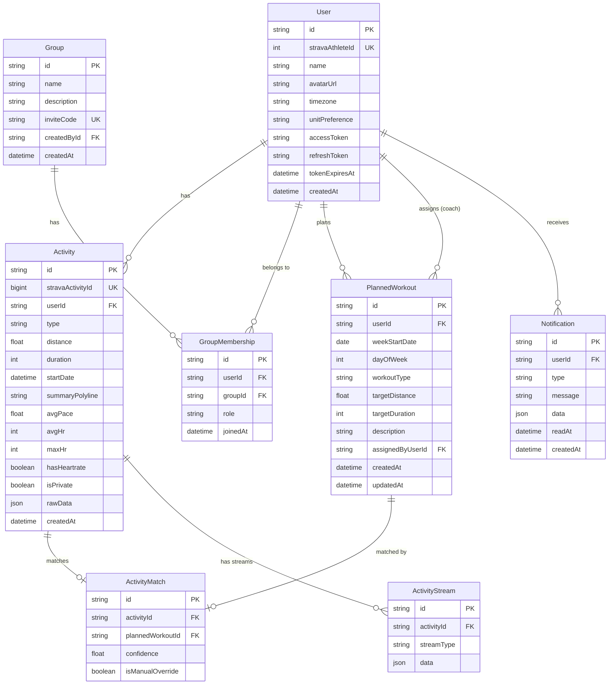

# feat: PaceUp — Training-Focused Running App

## Overview

PaceUp is a modern training-focused running app for running communities. It integrates with Strava for authentication and activity data, adding what Strava lacks: **weekly training planning, activity analysis with HR zones, and group accountability dashboards**. Think Strava meets TrainingPeaks — with a clean, modern UI that strips away social noise.

Target audience: running clubs, coaching groups, and friend circles (5-50+ people). (see brainstorm: docs/brainstorms/2026-03-13-paceup-brainstorm.md)

## Problem Statement / Motivation

Strava is the dominant activity tracker but has no training planning features. TrainingPeaks offers planning but with an outdated UI and no social layer. Runners who follow structured training plans must juggle multiple apps and manually compare planned vs. actual workouts. Coaches have no integrated way to assign plans and track athlete adherence.

PaceUp fills this gap by combining:
- Strava's activity data (via API) as the source of truth for completed workouts
- A weekly planner where runners or coaches define training targets
- An accountability dashboard showing plan vs. actual at the group level

## Proposed Solution

A monorepo containing a **React + TypeScript SPA** (Vite) and a **Node.js + Express API**, backed by **PostgreSQL + Prisma**. Strava handles all activity recording; PaceUp syncs data via webhooks and provides the planning/analysis/social layer on top.

### Architecture

```
┌──────────────────────────────────────────────────────────────┐
│                       PaceUp Monorepo                        │
│                                                              │
│  ┌──────────────────┐          ┌───────────────────────────┐ │
│  │  packages/web     │          │   packages/api            │ │
│  │  React + Vite     │ ◄──────►│   Express + Prisma        │ │
│  │  TanStack Query   │  REST   │                           │ │
│  │  Recharts/Mapbox  │         │  ┌─────────────────────┐  │ │
│  │  Tailwind + Radix │         │  │ Strava OAuth + Hooks │  │ │
│  │  PWA (Workbox)    │         │  │ BullMQ Workers       │  │ │
│  └──────────────────┘          │  │ Matching Engine      │  │ │
│                                │  └─────────┬───────────┘  │ │
│  ┌──────────────────┐          │            │              │ │
│  │  packages/shared  │          │   ┌───────┴───────┐      │ │
│  │  Types + Zod      │          │   │               │      │ │
│  │  schemas          │          │   ▼               ▼      │ │
│  └──────────────────┘          │ ┌──────────┐ ┌────────┐  │ │
│                                │ │PostgreSQL│ │ Redis  │  │ │
│                                │ │(Prisma)  │ │(BullMQ)│  │ │
│                                │ └──────────┘ └────────┘  │ │
│                                └───────────────────────────┘ │
└──────────────────────────────────────────────────────────────┘
                            │
                            ▼
                 ┌─────────────────────┐
                 │    Strava API v3    │
                 │  OAuth + Webhooks   │
                 │  Activities + Streams│
                 └─────────────────────┘
```

**Deployment:** Frontend to Vercel/Netlify, API to Railway/Fly.io, PostgreSQL managed (Railway/Supabase/Neon), Redis managed (Upstash/Railway).

### Implementation Phases

#### Phase 1: Foundation (Auth + Data Sync)

Core infrastructure that everything else depends on.

**1.1 Monorepo Setup**
- [ ] Initialize monorepo with npm workspaces (`packages/web`, `packages/api`, `packages/shared`)
- [ ] `packages/web`: Vite + React + TypeScript scaffold with PWA plugin (`vite-plugin-pwa`)
- [ ] `packages/api`: Express + TypeScript with Prisma
- [ ] `packages/shared`: Shared types/constants between web and api
- [ ] ESLint + Prettier config at root level
- [ ] `.env.example` files for both packages

**1.2 Database Schema + Prisma Setup**
- [ ] Initialize Prisma with PostgreSQL
- [ ] Core models (see ERD below):
  - `User` (stravaAthleteId, name, avatar, timezone, unitPreference, tokens)
  - `Activity` (stravaActivityId, userId, type, distance, duration, startDate, summaryPolyline, avgPace, avgHr, maxHr, hasHeartrate, isPrivate, raw JSON for extended data)
  - `ActivityStream` (activityId, type [heartrate/pace/altitude/latlng], data JSON)
  - `Group` (name, description, inviteCode, createdById)
  - `GroupMembership` (userId, groupId, role [coach|athlete], joinedAt)
  - `PlannedWorkout` (userId, weekStartDate, dayOfWeek, workoutType, targetDistance, targetDuration, description, assignedByUserId)
  - `ActivityMatch` (activityId, plannedWorkoutId, confidence, isManualOverride)
  - `Notification` (userId, type, message, data JSON, readAt)
- [ ] Seed script for development
- [ ] Migration for initial schema



**1.3 Strava OAuth Integration**
- [ ] Register PaceUp as a Strava API application (get client ID + secret)
- [ ] OAuth 2.0 flow: `/api/auth/strava` → redirect to Strava → `/api/auth/strava/callback`
- [ ] Request scopes: `read,activity:read_all,profile:read_all`
- [ ] **Partial consent detection**: parse `scope` query param in callback URL (source of truth for granted scopes). If `activity:read_all` missing, redirect to error page explaining the checkbox must be checked, with re-auth link using `approval_prompt=force`
- [ ] Handle denial (`error=access_denied`): redirect to landing page with explanation
- [ ] **Token encryption**: AES-256-GCM application-level encryption for refresh tokens (Node.js `crypto` module). Store `iv:authTag:ciphertext` format with key version column for rotation support. Encryption key in env var / secret manager.
- [ ] **Token refresh with per-user mutex**: use `async-mutex` to prevent concurrent refresh race conditions (Strava may invalidate old refresh token on issuing new one). Refresh proactively when within 60s of expiry.
- [ ] JWT session for PaceUp frontend (issued after Strava OAuth completes), HttpOnly cookie
- [ ] Handle Strava deauthorization webhook (`athlete.update` with `authorized: false`): delete Strava tokens, delete cached Strava data (per API compliance), mark user disconnected
- [ ] **Strava API compliance**: display "Powered by Strava" attribution on pages showing Strava data, link activities back to `strava.com/activities/{id}`, delete all Strava data on deauthorization

**1.4 Strava Webhook Subscription**
- [ ] POST `/api/webhooks/strava` endpoint — **respond 200 immediately**, enqueue event for async processing (Strava requires response within 2 seconds)
- [ ] GET `/api/webhooks/strava` endpoint for Strava's subscription validation challenge (echo `hub.challenge`)
- [ ] Handle event types: `activity.create`, `activity.update`, `activity.delete`, `athlete.update` (deauthorize)
- [ ] **Idempotent processing**: deduplicate events using composite key `{object_type}:{object_id}:{aspect_type}:{event_time}` stored in a `strava_webhook_events` table with `ON CONFLICT DO NOTHING`
- [ ] On `activity.create/update`: enqueue BullMQ job with dedup jobId `fetch-{activityId}-{aspect}`
- [ ] On `activity.delete`: soft-delete from local DB
- [ ] On `athlete.update` with `authorized: false`: trigger deauthorization cleanup
- [ ] Create subscription via Strava API on app deployment (`POST /push_subscriptions`)
- [ ] **Subscription health monitor**: daily cron that calls `GET /push_subscriptions` to verify subscription exists and callback URL is correct. Alert if missing.
- [ ] **Reconciliation cron** (every 30 min): for active users, fetch `GET /athlete/activities?after={2_hours_ago}` and upsert — catches any missed webhooks. Strava does NOT guarantee webhook delivery or retries.

**1.5 Activity Sync Engine**
- [ ] Rate limiter: track API calls per 15-min window and per day; reject when near limits
- [ ] Priority queue using BullMQ + Redis:
  - **P1**: Webhook-triggered activity fetches (real-time sync)
  - **P2**: On-demand user requests (manual refresh)
  - **P3**: Historical backfill (signup import)
- [ ] Backfill job on user signup: paginate through `GET /athlete/activities`, throttled to stay within rate limits
  - Backfill last 6 months by default (configurable)
  - Progress tracking per user (store last-fetched page)
  - Spread across multiple days if rate-limited
- [ ] Activity detail fetch: `GET /activities/{id}` for summary, `GET /activities/{id}/streams` for HR, pace, GPS, altitude data
- [ ] Periodic reconciliation cron (daily): compare recent Strava activities against local DB, fetch any missing
- [ ] Import all Strava activity types (running, cycling, swimming, etc.) — filter in UI layer (see brainstorm decision)

**1.6 Strava API Rate Limit Strategy**
- [ ] Track: requests used in current 15-min window + daily total
- [ ] Strava returns `X-RateLimit-Limit` and `X-RateLimit-Usage` headers — parse and store
- [ ] When at 80% of 15-min limit: pause P3 (backfill) jobs, continue P1/P2
- [ ] When at 90% of 15-min limit: pause P2, only P1 (webhook) continues
- [ ] When daily limit hit: queue everything for next day, show user-facing banner
- [ ] Exponential backoff on 429 responses

#### Phase 2: Core Features (Planner + Analysis)

**2.1 Weekly Training Planner**
- [x] Week view component: custom 7-column CSS Grid (`grid-template-columns: repeat(7, 1fr)`) with day headers. **Not** a calendar library — simpler, lighter, full design control. Each column is a `@dnd-kit` droppable zone.
- [x] Drag-and-drop with `@dnd-kit`: `useSortable` for reordering within a day, `useDraggable`/`useDroppable` for moving workouts between days. Mobile: long-press-to-reorder + "move to day" action menu (cross-column drag impractical on narrow screens).
- [x] Add/edit planned workout per day: workout type selector + distance/duration inputs
- [x] Workout types (V1 enum): Easy Run, Tempo Run, Interval/Speed, Long Run, Recovery Run, Race, Cross-Training, Rest Day
- [x] Plans are **per-user global** — one plan per athlete per week regardless of groups
- [ ] Coach plan assignment: coach selects athlete(s) from their group, assigns workouts
  - Coaches can only view/assign for athletes in their groups
  - Bulk assignment: assign same workout to multiple athletes at once
  - Athletes can freely edit coach-assigned plans (see brainstorm: collaborative model)
- [ ] Plan conflict: last-write-wins. If coach assigns and athlete edits, athlete's edit stands. Notification sent to coach.
- [x] Past week browsing: navigate to previous weeks (read-only archive)
- [x] Plan vs actual overlay: show matched Strava activities alongside planned workouts
- [ ] **Timezone handling**: plans use athlete's local timezone (from Strava profile or browser). Week boundaries computed in user's timezone.

**2.2 Activity-Plan Matching Engine**

**Matching pipeline** (runs on activity ingest via webhook, stores result persistently):
- [x] **Step 1 — Candidate set**: For each unmatched activity, find all unmatched planned workouts within +/- 1 calendar day (in athlete's timezone)
- [x] **Step 2 — Composite scoring**: Score each (activity, workout) pair using **geometric mean** of three signals (a zero in any dimension kills the match):
  - **Type score (weight 0.35)**: Map Strava `sport_type` to categories (`Run/TrailRun/VirtualRun` → running, `Ride/*Ride` → cycling, `Swim` → swimming, etc.). Running activities match any planned run type at 0.8. Cross-training types match `Cross-Training` plan at 0.7. Mismatched categories → 0.0.
  - **Distance score (weight 0.35)**: Asymmetric tolerance — going over is less penalized than going under (runners add warm-up/cooldown). Ratio 0.85-1.25 → 1.0, 0.70-0.85 → 0.7, 1.25-1.50 → 0.8, below 0.50 or above 2.0 → 0.1. Fall back to duration scoring if plan only specifies duration.
  - **Date score (weight 0.30)**: Same day → 1.0, off by 1 day → 0.6, off by 2 days → 0.2, beyond → 0.0
  - Formula: `score = typeScore^0.35 × distanceScore^0.35 × dateScore^0.30`
- [x] **Step 3 — Assignment**: Sort candidates by score descending, greedily assign (each activity and workout matched at most once). Unmatched activities shown as "Extra workout" in UI.
- [x] **Confidence thresholds**: ≥0.75 → auto-matched (green), 0.50-0.75 → likely match (confirm prompt), 0.25-0.50 → possible match (suggestion only), <0.25 → unmatched
- [x] Manual override: user can link any activity to any planned workout (or unlink)
- [x] Re-run matching when plans are edited or new activities arrive
- [ ] **Strava sport_type mapping table**: `Run/TrailRun/VirtualRun` → running, `Walk/Hike` → walking, `Ride/*Ride` → cycling, `Swim` → swimming, everything else → other_fitness
- [ ] **Timezone-aware date resolution**: always convert activity `start_date` to user's local timezone (IANA) before extracting calendar date. Use activity's own timezone for traveling runners.

**Plan vs actual comparison display:**
- [x] Per-matched-workout: show 2-3 delta metrics based on workout type:
  - Easy/Recovery run: distance delta + avg pace
  - Tempo: distance delta + pace delta (did they hit target pace?)
  - Long run: distance delta + duration delta
  - Interval: distance + total time
- [x] Weekly compliance bar: `Planned: 5 workouts / 52km | Actual: 4 workouts / 48km | 80% compliance`
- [x] Color coding: green (ratio 0.90-1.15), yellow (0.75-1.30), orange (outside), red (missed), blue (extra/unplanned)

**2.3 Activity Analysis Page**
- [x] Activity detail route: `/activity/:id`
- [x] Summary card: type, distance, duration, avg pace, date, elapsed time
- [x] Pace chart: **Recharts** `ComposedChart` — `Line` for pace per km/mile, `Area` for HR zone shading overlay (from velocity_smooth + heartrate streams)
- [x] Splits table: **TanStack Table** — per-km or per-mile splits with pace, elevation gain, HR. Sortable columns.
- [x] Heart rate zones: **Recharts** horizontal `BarChart` — zone distribution (Z1-Z5), avg HR, max HR
  - HR zones configurable per user (default: standard 5-zone model based on max HR)
  - Fetch user's HR zones from Strava `GET /athlete/zones` on signup
- [x] Elevation profile: **Recharts** `AreaChart` with `monotone` curve type (from altitude stream)
- [ ] Route map: **Mapbox GL JS** via `react-map-gl` — decode `summary_polyline` with `@mapbox/polyline` package, render as GeoJSON `LineString` via `<Source>` + `<Layer type="line">`. Use `mapbox://styles/mapbox/outdoors-v12` style. Lazy-load map component.
- [x] Plan vs actual comparison panel (if matched): show planned type/distance alongside actual
- [ ] **Responsive layout**: Desktop: 2-column (60% charts / 40% sticky map). Tablet: 50/50. Mobile: map on top (200px, expandable), charts stacked below.
- [x] Graceful degradation: hide HR section if no HR data, hide map if no GPS (manual entries), hide splits if no stream data
- [x] **Stream data storage**: JSONB column with column-oriented layout (`{time: [...], heartrate: [...], altitude: [...]}`) — PostgreSQL TOAST auto-compresses. Streams fetched on-demand when user opens activity detail (not during initial sync) to save rate limit budget.

**2.4 User Settings**
- [x] Unit preference: metric (km) / imperial (miles) — default metric, conversion at display layer
- [x] Timezone: auto-detect from browser, allow manual override
- [x] Strava connection status: show connected account, option to re-authorize
- [ ] Account deletion: delete all PaceUp data, revoke Strava access

#### Phase 3: Social + Groups

**3.1 Group Management**
- [x] Create group: name, optional description → generates unique invite code/link
- [x] Creator becomes coach by default
- [x] **Invite code generation**: 6-char alphanumeric from confusion-free alphabet (`23456789ABCDEFGHJKMNPQRSTUVWXYZ` — no 0/O/1/I/L). Codes double as links: `paceup.app/join/XKFM7R`. Store in `GroupInvite` table with `maxUses`, `useCount`, `expiresAt` (default 72h).
- [x] **Invite redemption**: atomic transaction — check expiry + maxUses + existing membership, increment `useCount`, create `GroupMembership`, all within `prisma.$transaction`. Rate-limit redemption endpoint: 5 attempts/15min per IP.
- [x] New joiners default to athlete role
- [x] Coach can promote athlete to co-coach or remove members
- [x] Coach can regenerate invite (creates new code, old code stays valid until expiry)
- [x] Leave group: athlete or coach can leave. If last coach leaves, ownership transfers to longest-tenured member.
- [x] Group settings page (coach only): manage members, roles, invite management
- [x] Users can be in multiple groups simultaneously

**Authorization middleware stack** (layered, applied to all `/groups/:groupId/*` routes):
- [x] `authenticate` → verifies JWT, sets `req.userId`
- [x] `loadGroupMembership` → looks up membership by `(userId, groupId)`, sets `req.membership` with role. Returns 403 if not a member.
- [x] `requireRole('COACH')` or `requireRole('COACH', 'ATHLETE')` → checks `req.membership.role`. Composable per-route.
- [x] Resource-level guards inline in handlers for cross-entity checks (e.g., "is target athlete in this group?")
- [x] Roll our own RBAC for V1 (2 roles, group-scoped). Migrate to CASL only if roles exceed 4+ or frontend needs serialized permission rules.

**3.2 Group Training View (Accountability Dashboard)**
- [x] Weekly grid: rows = group members, columns = Mon-Sun
- [x] Each cell shows: planned workout (type + distance) and actual activity (if matched)
- [x] Color coding: completed (green), missed (red/gray), partial (yellow), upcoming (muted)
- [x] Coach view: see all athletes' full details
- [x] Athlete view: see own full details + peer summary (completed/missed counts, not detailed metrics)
- [x] **Privacy enforcement at query layer**: all group-facing Prisma queries include `visibility: { not: 'PRIVATE' }` filter via reusable `visibleToGroup()` helper. Defense-in-depth: response sanitization middleware strips any private activities that slip through (logs violation for debugging). Private activities still count toward plan completion for the individual only.
- [x] Week navigation: browse past weeks
- [x] Group stats summary: total group km this week, completion rate percentage

**3.3 Activity Feed**
- [x] Feed route: `/feed`
- [x] Shows activities from all members of all groups the user belongs to (no separate follow system)
- [x] Each feed card: athlete name + avatar, activity type, distance, pace, duration, time ago, map thumbnail
- [x] Read-only for V1: no likes, no comments. Training data focus, not engagement.
- [x] Reverse chronological order with infinite scroll pagination
- [x] Private activities excluded from feed
- [x] Filter by group (optional)

**3.4 In-App Notifications**
- [x] Notification bell icon with unread count badge
- [x] Notification types (V1):
  - Coach assigned/modified your plan
  - New member joined your group
  - Your plan was edited by another coach
- [x] Notification center: list view, mark as read, click to navigate
- [x] No email or push notifications for V1

#### Phase 4: PWA + Polish

**4.1 PWA Configuration**
- [ ] `vite-plugin-pwa` setup with Workbox
- [ ] Web app manifest: name, icons, theme color, display: standalone
- [ ] Service worker: cache app shell (HTML, JS, CSS, fonts) for fast load
- [ ] App shell only for V1 offline — no data caching (see brainstorm: keep it simple)
- [ ] Offline fallback page: "You're offline. Connect to the internet to use PaceUp."
- [ ] Install prompt: rely on browser's native install prompt, no custom prompt in V1

**4.2 Onboarding Flow**
- [ ] Post-login welcome screen: "Welcome to PaceUp, [name]!"
- [ ] Step 1: Backfill status indicator — "Importing your Strava activities... (X of ~Y imported)"
- [ ] Step 2: Join or create a group (with option to skip)
- [ ] Step 3: Create your first weekly plan (with option to skip)
- [ ] Step 4: Land on dashboard

**4.3 Empty States**
- [ ] Training Planner (no plan): "No plan this week — create one?" with CTA button
- [ ] Activity list (backfill in progress): skeleton cards + "Importing from Strava..." message
- [ ] Activity list (no activities): "No activities yet. Complete a workout on Strava and it'll appear here."
- [ ] Feed (no groups): "Join a group to see your friends' activities" + join/create group CTA
- [ ] Group view (no groups): "Create or join a group to get started" + CTAs
- [ ] Group training view (no plans): "No plans this week. Assign plans to your athletes to get started."
- [ ] Notifications (empty): "No notifications yet"

**4.4 Loading + Error States**
- [ ] Skeleton loaders for all data-dependent views
- [ ] Activity detail: progressive loading (summary first, then streams/map)
- [ ] API error: toast notification with retry button
- [ ] Strava sync error: banner "Having trouble syncing with Strava. We'll retry automatically."
- [ ] Rate limit banner: "Strava sync paused temporarily. Your data will update shortly."

## Technical Considerations

### Recommended Library Stack

| Concern | Library | Rationale |
|---------|---------|-----------|
| Charts (activity detail) | **Recharts** | React-native, composable, strong TS types. `ComposedChart` for pace+HR overlay. |
| Charts (dashboard cards) | **Tremor** | Higher-level dashboard components, built on Recharts, Tailwind-native |
| Tables (splits, lists) | **TanStack Table** | Headless, fully typed, sortable/filterable |
| Maps | **Mapbox GL JS** via **react-map-gl** | WebGL performance, 50K free loads/mo, terrain support, clean polyline decode |
| Weekly planner DnD | **@dnd-kit** + custom CSS Grid | Purpose-built for React, accessible, 8KB vs 200KB+ for FullCalendar |
| Server state | **TanStack Query v5** | Caching, background refetch, optimistic mutations, webhook invalidation |
| Client UI state | **Zustand** | Selector-based subscriptions, zero boilerplate, works outside React tree |
| Styling | **Tailwind CSS** | Responsive prefixes, container queries, pairs with Tremor and Radix |
| UI primitives | **Radix UI** | Unstyled accessible components (modals, dropdowns, tooltips), full visual control |
| Routing | **React Router v7** | File-based routing, type-safe params, loaders for prefetching |
| Job queue | **BullMQ** | Built-in rate limiting, retries, repeatable jobs, concurrency control |
| ORM | **Prisma** | Type-safe, auto-generated client, easy migrations |
| Validation | **Zod** | Shared schemas between frontend/backend via `packages/shared` |
| Polyline decode | **@mapbox/polyline** | Decode Strava encoded polylines to GeoJSON |

### Strava API Integration
- **OAuth scopes**: `read,activity:read_all,profile:read_all` — all three required. Note: `activity:read_all` is **not pre-checked** on Strava's consent screen — users must manually tick it. Parse `scope` in callback to detect partial grants.
- **Token encryption**: AES-256-GCM at application level (Node.js `crypto`), stored as `iv:authTag:ciphertext` with key version for rotation. Encryption key in env var, never touches DB layer.
- **Token refresh**: per-user mutex (`async-mutex`) to prevent concurrent refresh races. Strava may invalidate old refresh token on issuing new one. Proactive refresh at 60s before expiry.
- **Webhook reliability**: Strava does NOT guarantee delivery or retries. Idempotent processing via dedup table. Reconciliation cron every 30 min as safety net. Subscription health-check cron daily.
- **Rate limits**: 200 req/15min, 2,000 req/day per application (not per user). BullMQ priority queue with `limiter: { max: 40, duration: 60000 }` (~160/15min, leaving headroom). Track via `X-RateLimit-Usage` headers stored in Redis.
- **Strava API compliance**: "Powered by Strava" attribution, link back to `strava.com/activities/{id}`, delete all Strava data on deauthorization, respect privacy flags.

### Background Job Processing
- **BullMQ + Redis**: Built-in rate limiting per queue, retries with exponential backoff, repeatable/scheduled jobs (replaces node-cron), concurrency control.
- **Priority system**: P1 webhook-triggered (user just finished activity) → P2 user-initiated (manual sync) → P3 reconciliation (cron) → P4 backfill (historical import). BullMQ `priority` option with lower number = higher priority.
- **Rate limit budget tracking**: store `X-RateLimit-Usage` in Redis. Auto-pause P3/P4 jobs at 80% of 15-min limit. Pause all at 90%. Daily limit reached → queue for next day + user-facing banner.
- **Bull Board** admin UI at `/admin/queues` for monitoring queue health, failed jobs, and throughput
- Job types: activity fetch, stream fetch, backfill page, token refresh, daily reconciliation, subscription health check, notification creation

### Security
- Strava tokens encrypted at rest (AES-256-GCM, application-level)
- JWT for frontend sessions, HttpOnly cookies, short expiry + refresh
- Webhook idempotency via dedup table (composite key: `object_type:object_id:aspect_type:event_time`)
- Rate limiting on PaceUp's own API endpoints (`express-rate-limit`), plus stricter limit on invite redemption (5/15min per IP)
- CORS configuration: only allow frontend origin
- Input validation on all endpoints (Zod)
- Privacy enforced at query layer (not just UI) via reusable `visibleToGroup()` Prisma filter + defense-in-depth response sanitizer

### Performance
- Activity list pagination (cursor-based, not offset)
- Database indexes on: `Activity.stravaActivityId`, `Activity.userId + startDate`, `GroupMembership.groupId + role`, `GroupMembership.userId`, `PlannedWorkout.userId + weekStartDate`
- Map component lazy-loaded (code-split) — only loads Mapbox on activity detail route
- Activity streams fetched on-demand (not during initial sync) to save rate limit budget
- Stream data stored as JSONB with column-oriented layout — TOAST auto-compresses (200-500KB JSON → 50-150KB compressed)
- TanStack Query with `staleTime` tuned per query type: activity history (5min), current week plan (refetch on window focus), group dashboard (1min)

### Frontend Architecture
- **State management**: TanStack Query for all server-derived data. Zustand for UI state (selected date range, active chart metric, sidebar/modal state, drag state). Never duplicate server state in Zustand.
- **Real-time updates**: when webhook syncs a new activity, backend can notify frontend via SSE or polling. Frontend calls `queryClient.invalidateQueries({ queryKey: ['activities'] })` — TanStack Query refetches and updates all subscribed components.
- **Weekly planner**: custom 7-column CSS Grid with `@dnd-kit` for drag-and-drop. Mobile: switch to single-day swipe view with long-press-to-reorder.
- **Responsive layout**: CSS Grid with container queries. Desktop: sidebar + main. Tablet: collapsible sidebar overlay. Mobile: bottom nav + single column. Use `100dvh` (not `vh`) for mobile browser chrome.

### Timezone Model
- All dates stored as UTC in database
- User's IANA timezone stored in profile (from Strava or browser detection)
- Plan dates (weekStartDate, dayOfWeek) interpreted in user's local timezone
- Activity display: convert `start_date` using **activity's own timezone** (from Strava) for traveling runners, otherwise user's home timezone
- Week boundary: Monday 00:00 in user's timezone

## System-Wide Impact

### Interaction Graph
- Strava webhook → Express handler → validates signature → enqueues BullMQ job → worker fetches activity from Strava → stores in DB → triggers activity-plan matching → creates/updates ActivityMatch → if match found, creates notification for user
- Coach assigns plan → PlannedWorkout created → notification sent to athlete → matching engine re-runs for that day → ActivityMatch updated

### Error Propagation
- Strava API 401 → token refresh middleware → retry → if refresh fails → mark user as disconnected → show re-auth prompt in UI
- Strava API 429 → rate limiter pauses queue → retries after rate limit window resets → user sees "sync paused" banner
- Webhook delivery failure → Strava does NOT reliably retry → reconciliation cron (every 30 min) catches any gaps by comparing recent Strava activities against local DB

### State Lifecycle Risks
- **Token expiry without refresh**: user appears connected but all syncs fail silently. Mitigation: proactive refresh, health-check on login.
- **Orphaned activities**: if a user deletes their account, activities in other users' feeds need to be cleaned up. Use cascading deletes or soft-delete with cleanup job.
- **Stale backfill state**: if backfill fails mid-way, the progress cursor must be persisted so it can resume, not restart.

## Acceptance Criteria

### Functional Requirements
- [ ] User can sign in with Strava and land on dashboard
- [ ] Activities sync automatically via webhooks within 60 seconds of Strava upload
- [ ] Historical activities (last 6 months) imported on signup
- [ ] User can create, edit, and delete weekly training plans
- [ ] Coach can assign plans to athletes in their group
- [ ] Activities auto-match to planned workouts with confidence scores
- [ ] User can manually override activity-plan matches
- [ ] Activity detail shows pace chart, splits, HR zones, elevation, and map
- [ ] Users can create groups, invite others, and manage roles
- [ ] Group training view shows plan vs actual for all members
- [ ] Activity feed shows group members' (non-private) activities
- [ ] In-app notifications for key events (plan assigned, member joined)
- [ ] PWA installable with cached app shell
- [ ] All views have designed empty states, loading states, and error states
- [ ] Metric/imperial unit toggle works across all views

### Non-Functional Requirements
- [ ] Strava API rate limits never exceeded (queue + prioritization)
- [ ] Page load < 2s on 3G connection (app shell cached)
- [ ] Activity detail page loads within 3s (progressive loading)
- [ ] Private Strava activities never visible in group views or feeds
- [ ] Strava tokens encrypted at rest
- [ ] All API endpoints validated and rate-limited

## Dependencies & Risks

| Risk | Likelihood | Impact | Mitigation |
|------|-----------|--------|------------|
| Strava rate limits too restrictive for growth | High | High | Webhook-first architecture, aggressive caching, backfill throttling, apply for increased limits |
| Strava changes API or deprecates endpoints | Low | High | Abstract Strava calls behind service layer, monitor Strava changelog |
| Webhook subscription silently drops | Medium | High | Health-check cron that verifies subscription status daily |
| Users don't grant `activity:read_all` scope | Medium | Medium | Clear explanation of why it's needed, re-auth flow |
| Complex timezone edge cases | Medium | Medium | Store everything UTC, convert at display layer, test with users across timezones |

## Success Metrics

- Users create weekly plans for 3+ consecutive weeks (retention)
- 80%+ of synced activities auto-match with planned workouts at >0.7 confidence
- Group training view checked at least 2x/week by active group members
- Activity backfill completes within 24 hours of signup (even with rate limits)
- Zero incidents of private activity exposure in group views

## Sources & References

### Origin
- **Brainstorm document:** [docs/brainstorms/2026-03-13-paceup-brainstorm.md](docs/brainstorms/2026-03-13-paceup-brainstorm.md) — Key decisions carried forward: Strava-only auth, per-user-global plans with coach-scoped view, React + Express monorepo, webhooks + backfill sync, PWA app-shell-only offline

### External References
- Strava API v3 documentation: developers.strava.com
- Strava API reference (Swagger): developers.strava.com/docs/reference
- Strava webhook events: developers.strava.com/docs/webhooks
- Strava OAuth: developers.strava.com/docs/authentication
- Strava rate limits: developers.strava.com/docs/rate-limits
- Prisma with Express: prisma.io/docs/guides
- vite-plugin-pwa: vite-pwa-org.netlify.app
- BullMQ (job queue): docs.bullmq.io
- Bull Board (queue dashboard): github.com/felixmosh/bull-board
- Mapbox GL JS (for route maps): docs.mapbox.com/mapbox-gl-js
- react-map-gl: visgl.github.io/react-map-gl
- Recharts: recharts.org
- Tremor (dashboard components): tremor.so
- TanStack Query: tanstack.com/query
- TanStack Table: tanstack.com/table
- @dnd-kit: dndkit.com
- Zustand: zustand-demo.pmnd.rs
- Radix UI: radix-ui.com
- Tailwind CSS: tailwindcss.com
