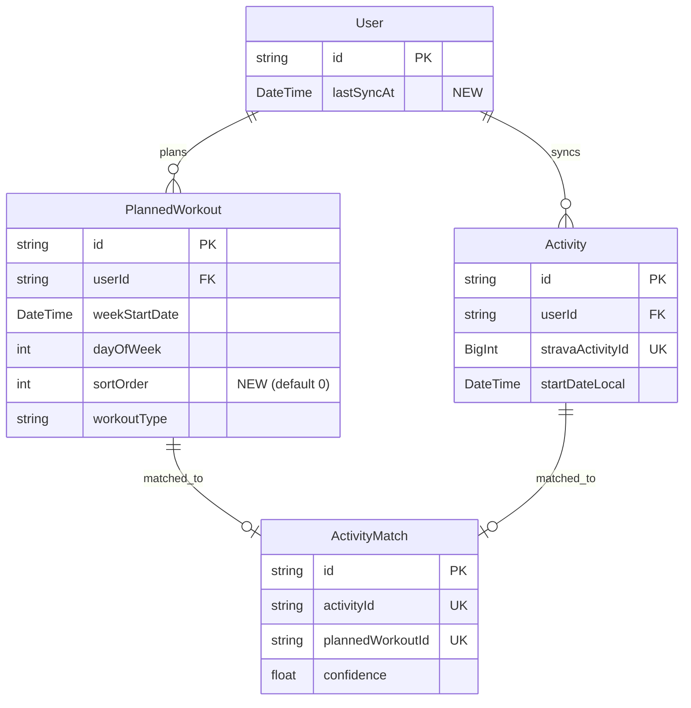

# PaceUp Overhaul — Sync, Matching, Design & Mobile

## Overview

Comprehensive overhaul of PaceUp covering four interconnected areas: (1) rework Strava sync to use a smart stale-based single 200-activity list fetch with real-time SSE progress, (2) remove the one-workout-per-day database constraint and fix matching to support multiple activities per day, (3) introduce a bold neobrutalism design system with a design doc, and (4) make the entire app mobile-responsive with architecture for eventual React Native.

Includes a full data reset (activities, matches, planned workouts) to start fresh after the sync fixes.

## Problem Statement

1. **Sync is broken/opaque** — Users can't tell if sync is working. The paginated backfill (30 per page, queued sequentially) is slow, and activities aren't allocated correctly to training plans. There's no clear feedback on sync progress or failures.

2. **One workout per day is too restrictive** — The `PlannedWorkout` model has a `@@unique([userId, weekStartDate, dayOfWeek])` constraint, preventing multiple workouts per day. Runners who do two-a-days (morning run + evening strength) can't plan properly. The `ActivityMatch` model also enforces strict 1:1 matching.

3. **Planner hides completed activities** — The planner page only shows planned workouts with their matches. If matching fails or there's no plan for that day, activities are invisible. Users can't see their full training picture on the /planner page.

4. **Design is outdated** — Default Tailwind styling with no personality or brand identity. All styling is inline utility classes scattered across 15+ components.

5. **No mobile support** — The planner uses a hardcoded `grid-cols-7` layout (~46px per column on a 375px screen). No hamburger menu, no bottom navigation, touch targets too small. The app is desktop-only.

## Proposed Solution

### Phase 1: Data Reset + Schema Changes (Foundation)

Reset all synced data and update the database schema to support multi-workout per day.

#### 1.1 Data Reset Script

Create a one-time reset script (not a permanent endpoint yet) to:
1. Cancel all in-flight BullMQ sync jobs for the user
2. Delete all `ActivityMatch` records for the user
3. Delete all `Activity` records (cascades to `ActivityStream`)
4. Delete all `PlannedWorkout` records
5. Set `lastSyncAt` to null (new field, see 1.2)

_(see brainstorm: docs/brainstorms/2026-03-14-paceup-overhaul-sync-matching-design-brainstorm.md — "Full reset" decision)_

**Files:**
- `packages/api/src/scripts/reset-user-data.ts` (new)

#### 1.2 Schema Migration: Multi-Workout + Sync Tracking

```prisma
// schema.prisma changes

model User {
  // Add:
  lastSyncAt DateTime?  // Tracks when the last Strava sync completed
}

model PlannedWorkout {
  // Add:
  sortOrder Int @default(0)  // Ordering within the same day

  // REMOVE the unique constraint:
  // @@unique([userId, weekStartDate, dayOfWeek])
  // REPLACE with non-unique index for query performance:
  @@index([userId, weekStartDate, dayOfWeek])
}
```

**Migration file:** `packages/api/prisma/migrations/YYYYMMDDHHMMSS_multi_workout_per_day/migration.sql`

```sql
-- Add lastSyncAt to User
ALTER TABLE "User" ADD COLUMN "lastSyncAt" TIMESTAMP(3);

-- Add sortOrder to PlannedWorkout
ALTER TABLE "PlannedWorkout" ADD COLUMN "sortOrder" INTEGER NOT NULL DEFAULT 0;

-- Drop the unique constraint (allows multiple workouts per day)
ALTER TABLE "PlannedWorkout" DROP CONSTRAINT "PlannedWorkout_userId_weekStartDate_dayOfWeek_key";

-- Add non-unique index for query performance
CREATE INDEX "PlannedWorkout_userId_weekStartDate_dayOfWeek_idx"
  ON "PlannedWorkout"("userId", "weekStartDate", "dayOfWeek");
```

**API changes after migration:**
- `packages/api/src/routes/workouts.ts`: Remove the `P2002` catch block (line ~106) that returns 409 "A workout already exists for this day"
- Add `orderBy: [{ dayOfWeek: 'asc' }, { sortOrder: 'asc' }]` to workout queries



### Phase 2: Sync Overhaul

Replace the paginated backfill with a smart, stale-based single-call sync.

#### 2.1 Stale-Based Sync Trigger

When the frontend loads the dashboard (or SSE connects), check if the user's `lastSyncAt` is older than 1 hour. If stale, trigger a sync.

**Trigger mechanism:** New API endpoint `POST /api/sync/trigger` that:
1. Checks `user.lastSyncAt` — if <1 hour ago, returns `{ status: 'fresh' }`
2. If stale, enqueues a single "list-sync" job in a new `sync-list` queue
3. Returns `{ status: 'syncing' }` immediately
4. SSE broadcasts progress as usual

**Files:**
- `packages/api/src/routes/sync-status.ts` — Add `POST /trigger` endpoint
- `packages/web/src/lib/hooks.ts` — Add `useTriggerSync()` mutation, call on dashboard mount

_(see brainstorm — "Smart: if stale" with 1-hour threshold)_

#### 2.2 New List-Sync Worker

Replace the paginated backfill approach. The new worker:
1. Calls `fetchAthleteActivities(userId, { perPage: 200, after: lastSyncAt })` — single call
2. Batch-checks which activities already exist in DB
3. Enqueues detail-fetch jobs for new activities only (reuses existing `activity-sync` queue)
4. Reports progress: `{ userId, status: 'listing', total: N }`
5. If response has exactly 200 activities (might be more), enqueue page 2 with `page: 2` — handle overflow
6. Updates `user.lastSyncAt` after list call completes
7. Returns `{ userId }` for the completed listener

**Files:**
- `packages/api/src/queues/sync-worker.ts` (new — replaces backfill-worker.ts)
- `packages/api/src/queues/index.ts` — Add `sync-list` queue definition
- `packages/api/src/services/sync-events.ts` — Add QueueEvents listener for `sync-list`
- `packages/api/src/index.ts` — Start new worker, graceful shutdown

**What happens to `backfill-worker.ts`:** Remove it. The reconciliation cron (`packages/api/src/cron/reconciliation.ts`) should use the new sync-list approach instead of the old backfill queue.

#### 2.3 Update Rate Limiter

The hardcoded defaults in `packages/api/src/lib/rate-limiter.ts` use 200/15min and 2000/day. Update to match actual Strava limits:
- Short-term: 300 reads / 15 minutes (use read limits since all our calls are reads)
- Daily: 3000 reads / day
- Keep the header-based self-correction (`updateFromHeaders`)

**Files:**
- `packages/api/src/lib/rate-limiter.ts` — Update `shortTermLimit` to 300, `dailyLimit` to 3000

#### 2.4 Sync Progress UX

The SSE infrastructure already exists. The sync progress indicator in the navbar (`SyncStatusIndicator.tsx`) already shows syncing state. Enhancements:
- Show "Syncing 45/200 activities..." with a count
- Show "Sync complete" briefly, then fade
- Show "Sync failed (3 activities could not be fetched)" for partial failures

**Files:**
- `packages/web/src/components/SyncStatusIndicator.tsx` — Enhanced progress display

### Phase 3: Matching Fixes

#### 3.1 Multi-Activity-Per-Day Matching

The matching algorithm in `packages/api/src/lib/matching.ts` already uses greedy assignment and doesn't inherently require one-workout-per-day. The constraint was at the database level. With the constraint removed:

- The algorithm scores all `(activity, workout)` pairs for the week
- Greedy assignment picks highest-scoring pairs first
- No double-booking: each activity matches at most one workout, each workout matches at most one activity
- Multiple activities on the same day can match different workouts on that day

**No algorithm changes needed** — the greedy assignment already handles this correctly.

_(see brainstorm — "Best score wins" decision)_

#### 3.2 Re-Match on Workout Edit

When a planned workout is edited (type or distance changed), delete its existing match and re-run matching for the week.

**Files:**
- `packages/api/src/routes/workouts.ts` — In `PUT /:id`, after update: delete existing match, call `runMatchingForUser(userId, weekStartDate)`

### Phase 4: Planner Updates

#### 4.1 Extend Workouts API to Include Activities

Add unmatched activities to the workouts endpoint response for the planner:

```typescript
// GET /api/workouts?weekStart=YYYY-MM-DD
// Response shape:
{
  workouts: PlannedWorkout[], // with matches
  activities: Activity[],     // NEW: all activities for the week (matched + unmatched)
}
```

The planner can then:
- Show planned workouts with match status (top section of each day)
- Show unmatched activities below a divider (activities where `id` is not in any match)

**Files:**
- `packages/api/src/routes/workouts.ts` — Extend GET `/` to also query activities for the week
- `packages/web/src/lib/hooks.ts` — Update `useWorkouts` return type to include activities

#### 4.2 Planner UI — Dual Display

Update the planner page to show both sections per day:

```
┌─────────────────────────┐
│ Monday 17 Mar           │
├─────────────────────────┤
│ ✅ Easy Run 10km        │  ← Planned workout (matched)
│    ✓ Morning Run 9.8km  │
│                         │
│ 🟡 Strength 45min      │  ← Planned workout (unmatched)
├─ ─ ─ ─ ─ ─ ─ ─ ─ ─ ─ ─┤
│ 🏃 Evening Jog 5.2km   │  ← Unmatched activity
└─────────────────────────┘
```

_(see brainstorm — "Both, visually separated" decision)_

**Files:**
- `packages/web/src/pages/Planner.tsx` — Add unmatched activities section per day
- `packages/web/src/components/WorkoutCard.tsx` — May need an "ActivityCard" variant

### Phase 5: Neobrutalism Design System

#### 5.1 Design Document

Create a design system document defining the neobrutalism visual language before any implementation.

**File:** `docs/design-system.md`

**Contents:**
- **Color palette**: Primary brand (orange `#ff6b35`), accents (yellow `#FFD700`, pink `#FF69B4`, blue `#4169E1`), background white `#FAFAFA`, text black `#1A1A1A`
- **Borders**: 2-3px solid black on all cards/buttons/inputs
- **Shadows**: Offset box-shadow `4px 4px 0 #1A1A1A` on interactive elements
- **Typography**: Bold headings, clean body text, monospace for data/numbers
- **Buttons**: Chunky with thick borders, offset shadow, hover shifts shadow
- **Cards**: White background, thick border, offset shadow
- **Inputs**: Thick bottom border or full border, no rounded corners (or minimal `rounded-sm`)
- **Color coding for workout types**: Maintain but brighten (Easy=lime, Tempo=orange, Interval=pink, Long=blue, Rest=gray)
- **Match confidence colors**: Green (high), yellow (medium), orange (low)
- **Mobile-specific**: Larger touch targets (min 44px), bottom tab bar

_(see brainstorm — "Bold + colorful" neobrutalism decision)_

#### 5.2 Tailwind Configuration

Extend `tailwind.config.js` with design tokens:

```javascript
// tailwind.config.js
theme: {
  extend: {
    colors: {
      brand: { /* existing orange scale */ },
      neo: {
        yellow: '#FFD700',
        pink: '#FF69B4',
        blue: '#4169E1',
        lime: '#84CC16',
        black: '#1A1A1A',
        white: '#FAFAFA',
      }
    },
    borderWidth: {
      neo: '3px',
    },
    boxShadow: {
      neo: '4px 4px 0 #1A1A1A',
      'neo-sm': '2px 2px 0 #1A1A1A',
      'neo-hover': '2px 2px 0 #1A1A1A', // shifts on hover
    },
    fontFamily: {
      display: ['Space Grotesk', 'sans-serif'],
      mono: ['JetBrains Mono', 'monospace'],
    },
  }
}
```

**Files:**
- `packages/web/tailwind.config.js` — Design tokens
- `packages/web/src/index.css` — Base layer styles, font imports

#### 5.3 Shared Components

Create a small set of reusable neo-styled components:

- `packages/web/src/components/ui/Button.tsx` — Neo button with shadow
- `packages/web/src/components/ui/Card.tsx` — Neo card with border + shadow
- `packages/web/src/components/ui/Input.tsx` — Neo text input
- `packages/web/src/components/ui/Badge.tsx` — Neo badge/chip

#### 5.4 Apply Design to All Pages

Restyle each page using the design system. Order:
1. Layout shell (Navbar, page wrapper)
2. Dashboard
3. Planner
4. Activities
5. Activity Detail
6. Groups / Group Training
7. Feed
8. Settings

### Phase 6: Mobile Responsiveness

#### 6.1 Bottom Tab Navigation

Replace the top navbar links with a bottom tab bar on mobile:

```
┌──────────────────────────────────┐
│  🏃 PaceUp              [avatar]│  ← Minimal top bar (logo + profile)
├──────────────────────────────────┤
│                                  │
│         Page Content             │
│                                  │
├──────────────────────────────────┤
│ 🏠  📅  🏃  👥  ⚙️             │  ← Bottom tabs (mobile only)
│ Home Plan Run  Team  More        │
└──────────────────────────────────┘
```

**Files:**
- `packages/web/src/components/Navbar.tsx` — Hide nav links on mobile
- `packages/web/src/components/BottomTabs.tsx` (new) — Mobile bottom navigation
- `packages/web/src/App.tsx` — Add BottomTabs to layout

#### 6.2 Planner Mobile Layout

On screens <768px, switch from 7-column grid to a vertical day stack:

```
┌────────────────────────┐
│ ← Week of Mar 17  →   │  ← Week navigation
├────────────────────────┤
│ ▼ Monday 17            │  ← Collapsible day (today expanded by default)
│   Easy Run 10km ✅     │
│   Evening Jog 5.2km    │
├────────────────────────┤
│ ▶ Tuesday 18           │  ← Collapsed (tap to expand)
├────────────────────────┤
│ ▶ Wednesday 19         │
└────────────────────────┘
```

**Files:**
- `packages/web/src/pages/Planner.tsx` — Responsive layout with breakpoints

#### 6.3 Responsive All Pages

- Dashboard: Already partially responsive (`sm:grid-cols-2 lg:grid-cols-4`), just needs neo styling
- Activities: Stack filter bar vertically on mobile, card layout instead of table rows
- Activity Detail: Single column, full-width map/chart
- Groups: Card layout instead of table
- Settings: Already single column

#### 6.4 Architecture for React Native

Keep business logic portable but don't over-abstract now:
- Hooks (`hooks.ts`, `sync.ts`) are already framework-agnostic (Zustand + TanStack Query work in RN)
- API client (`api.ts`) is portable
- Components are NOT portable (Tailwind → RN StyleSheet)
- Decision: Extract shared types to a `packages/shared` package only when the RN project starts

_(see brainstorm — "Eventually native" decision)_

## System-Wide Impact

### Interaction Graph

- Sync trigger → `POST /api/sync/trigger` → Enqueues list-sync job → BullMQ worker fetches Strava list → Enqueues N activity-sync jobs → Each job: fetch detail → upsert activity → `runMatchingForActivity()` → Upserts `ActivityMatch` → SSE broadcasts progress/complete → Frontend invalidates React Query caches
- Data reset → Cancel BullMQ jobs → Delete matches → Delete activities (cascades streams) → Delete workouts → Clear `lastSyncAt` → Trigger fresh sync

### Error & Failure Propagation

- Strava API errors → `StravaApiError` with status + retryAfter → BullMQ retry (3 attempts, exponential backoff) → If all fail, `sync-error` SSE event with userId and failure count
- Rate limit exceeded → `rate-limiter.ts` blocks request based on priority → Worker retries after `retryAfter` header delay
- Database errors → Prisma errors bubble to worker → Worker marks job failed → SSE error event

### State Lifecycle Risks

- **Data reset during active sync**: Mitigated by cancelling all queued jobs before deletion. In-progress jobs may complete and re-insert — acceptable since a re-sync follows immediately.
- **Partial sync failure**: Some activities persist, others don't. Matching runs per-activity, so partial data is consistently matched. Missing activities will be caught by the next sync or reconciliation.

## Acceptance Criteria

### Functional Requirements

- [ ] `lastSyncAt` field on User model, updated after each sync
- [ ] Sync triggers automatically when dashboard loads and last sync >1 hour ago
- [ ] Single Strava list call fetches up to 200 activities, queues detail fetches
- [ ] If list returns 200 (may have more), continues to page 2
- [ ] Sync progress shows in navbar: "Syncing 45/200..."
- [ ] Multiple workouts can be created per day (no limit)
- [ ] PlannedWorkout sorted by `sortOrder` within each day
- [ ] Matching supports multiple activities per day using greedy best-score
- [ ] Editing a workout re-triggers matching for the week
- [ ] Planner shows planned workouts + unmatched activities, visually separated
- [ ] Neobrutalism design doc created with color palette, borders, shadows, components
- [ ] All pages restyled with neobrutalism design tokens
- [ ] Shared UI components: Button, Card, Input, Badge
- [ ] Bottom tab navigation on mobile
- [ ] Planner collapses to vertical day stack on mobile (<768px)
- [ ] All pages responsive (no horizontal scroll on 375px screen)
- [ ] Full data reset: delete activities, matches, planned workouts, re-sync
- [ ] Rate limiter defaults updated to 300/3000 (reads)
- [ ] Old backfill worker removed

### Non-Functional Requirements

- [ ] Sync of 200 activities completes within 25 minutes (at 10 jobs/min rate limit)
- [ ] Planner page renders <1s with 20 workouts + 30 activities per week
- [ ] Touch targets minimum 44px on mobile
- [ ] WCAG AA color contrast on all neobrutalism elements

## Implementation Phases

### Phase 1: Foundation (Schema + Reset)

- [ ] Add `lastSyncAt` to User model
- [ ] Add `sortOrder` to PlannedWorkout, drop unique constraint
- [ ] Create + run migration
- [ ] Remove P2002 catch block in workouts route
- [ ] Add `orderBy: sortOrder` to workout queries
- [ ] Create data reset script
- [ ] Run data reset for Lucas's account

### Phase 2: Sync Overhaul

- [ ] Create `sync-list` queue + `sync-worker.ts`
- [ ] Add `POST /api/sync/trigger` endpoint
- [ ] Add QueueEvents listener for sync-list
- [ ] Update rate limiter defaults (300/3000)
- [ ] Remove old `backfill-worker.ts` and `activity-backfill` queue
- [ ] Update reconciliation cron to use new sync approach
- [ ] Add `useTriggerSync()` hook, call on dashboard mount
- [ ] Update SSE progress display in SyncStatusIndicator
- [ ] Wire up `lastSyncAt` update after sync completes

### Phase 3: Matching + Planner

- [ ] Re-trigger matching on workout edit
- [ ] Extend GET /api/workouts to return activities for the week
- [ ] Update planner UI: dual display (workouts + unmatched activities)
- [ ] Test multi-workout-per-day matching with varied scenarios

### Phase 4: Design System

- [ ] Create `docs/design-system.md`
- [ ] Configure Tailwind tokens (colors, borders, shadows, fonts)
- [ ] Build shared UI components (Button, Card, Input, Badge)
- [ ] Import fonts (Space Grotesk, JetBrains Mono)

### Phase 5: Design Application + Mobile

- [ ] Restyle Navbar + add BottomTabs
- [ ] Restyle Dashboard
- [ ] Restyle Planner (including mobile vertical stack)
- [ ] Restyle Activities page (card layout on mobile)
- [ ] Restyle Activity Detail
- [ ] Restyle Groups / Group Training
- [ ] Restyle Settings
- [ ] Restyle auth flow / landing
- [ ] Final responsive QA pass on 375px, 768px, 1280px

## Dependencies & Risks

| Risk | Mitigation |
|------|-----------|
| Strava rate limit exhaustion during multi-user sync | BullMQ rate limiter (10 jobs/min) spreads load; header-based self-correction |
| Data reset destroys coach-assigned workouts | For now (single user), not an issue. Future: exclude coach-assigned workouts |
| Neobrutalism redesign touches every component | Design tokens in Tailwind config reduce per-file changes |
| Planner mobile layout is complex | Start with simple vertical stack, iterate |
| Migration drops unique constraint on production data | Only one user, low risk. For production: test migration on staging first |

## Sources & References

### Origin

- **Brainstorm document:** [docs/brainstorms/2026-03-14-paceup-overhaul-sync-matching-design-brainstorm.md](docs/brainstorms/2026-03-14-paceup-overhaul-sync-matching-design-brainstorm.md) — Key decisions: smart stale-based sync (1h threshold), unlimited workouts/day, best-score matching, bold neobrutalism, responsive web first

### Internal References

- Prisma schema: `packages/api/prisma/schema.prisma`
- Matching algorithm: `packages/api/src/lib/matching.ts`
- Rate limiter: `packages/api/src/lib/rate-limiter.ts`
- Strava API client: `packages/api/src/lib/strava-api.ts`
- Backfill worker (to replace): `packages/api/src/queues/backfill-worker.ts`
- Activity worker (to keep): `packages/api/src/queues/activity-worker.ts`
- Planner page: `packages/web/src/pages/Planner.tsx`
- SSE infrastructure: `packages/api/src/services/sync-status.ts`, `packages/api/src/services/sync-events.ts`
- Hooks: `packages/web/src/lib/hooks.ts`
- Tailwind config: `packages/web/tailwind.config.js`
